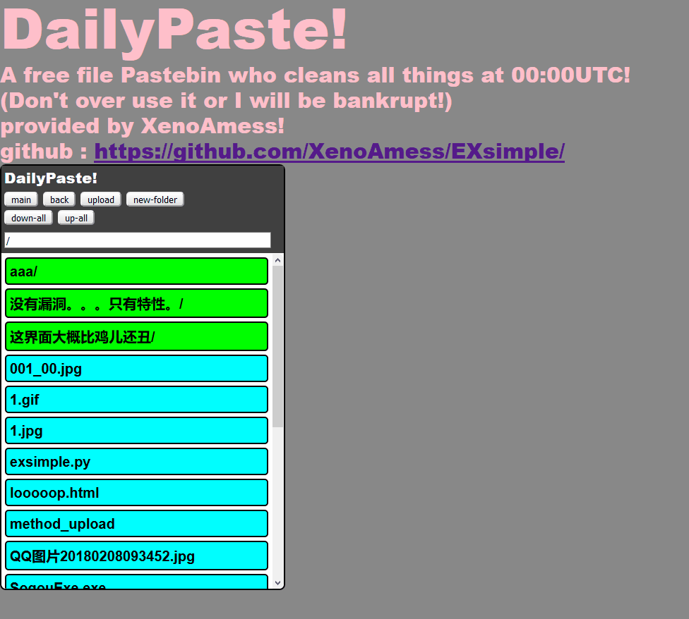
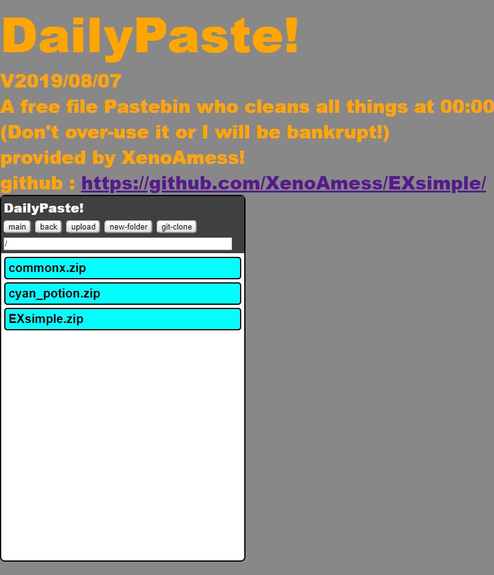

# EXsimple

# living example
http://dailypaste.com/
	
# what is it:
  
  It is used as a public,open,share netdisc.
  
  Yes,it supports multi-files upload in one turn.
  
  Actually it is a light Web application framework  exactly easy to deploy , which has implyments of POST,GET,HEAD methods.
  
  
# drag it to move!
  It might be really hard to notice it without Instructions. 
  
  
# enter a not-in-use url, and press Enter,then press new-folder button,boom!a new folder appears!
  It might be really hard to notice it without Instructions,too.
  

# clone git repo and zip it into current folder for download!
  You know some people have bad connection to some git repo, so this can be used as a cache.
  
  * You must have git installed on the server machine before you do that.

# cache files from url to server!
  Sometimes we just need this.
  
  * Do not cache large files to http://dailypaste.com .I only have 20G ssd there.
  * Feel free to do it on your own vps.

# get it in a iframe, and it would be streamline smartly!

<iframe src="http://dailypaste.com/" frameborder="0" scrolling="no" width="404" height="604">Dailypaste!</iframe>

# Do not upload a file with a same name to a file in the same folder.
  doing that would replace the old file with the new one,the old file just rest-in-peace.
  
  this is used for people to update their own file,not used to f**k up others' file.
  
  I hope nobody shall be that bad person,making fun in others' pain.
  
# notice:
  some codes are modified from others' in their blogs.I had put links on the front these codes.of course I had no complete rights with these codes.thanks for the original authors to write blogs to teach me so much.thank you.
  
  if you are one of these authors,but you don't want me use your code ,please tell me.I will rewrite that part.
  
# how to use:

  simple: (in windows)
  
          double click.
	  
          it will show start and show you what you wanna know.
	  
          (in linux)
	  
          cd to the folder witch exsimple.py in.
	  
          python3 exsimple.py
	  
          it will show start and show you what you wanna know.
	  
  advanced:
  
          open the score code to change whatever you want.
          
          also,notice that if you use pypy3 instead of python3,it might run far faster.
          
          nuitka is even far more faster than pypy.but it is not so easy to use.
